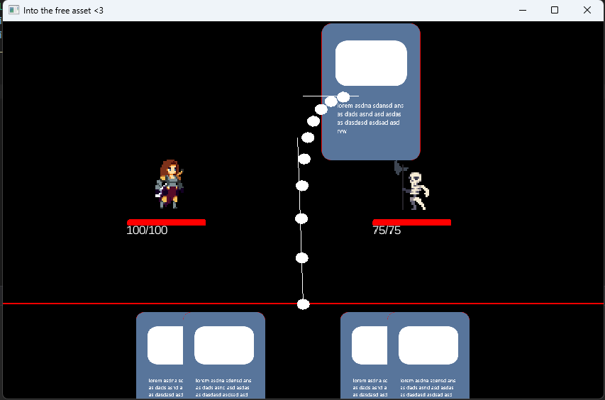

# Into the free assets

l'idée du jeux était de faire un slay the spire avec du contenue gratuit.

> pour voir le code aller dans `core/src/com.mygdx.game/*`

## image

## ce que j'ai appris : 

en jeux vidéo :

- Animation de sprites.
- Gestion de la caméra.
- Utilisation de courbes de Bézier.
- Gestion des personnages.
- Animation des mouvements 2D pour la main de carte.
- Création de scènes.
- Mise en place de conteneurs réutilisables.
- Appréhension des ordres de grandeur lors de la conception d'un jeu vidéo.

en java :
- Mise en application de la programmation orientée objet .
- Manipulation d'images.
- Gestion des entrées utilisateur.
- Gestion des événements.
- Algorithmes et logique de jeu.
- Utilisation de la bibliothèques graphiques GDX.

## Lancer le projet :

La meilleure approche consiste à ouvrir IntelliJ, car il est capable de comprendre automatiquement l'ensemble du projet.

> Puis aller à `./desktop/src/com.mygdx.game/DesktopLauncher.java`
> 
> c'est le point d'entré

